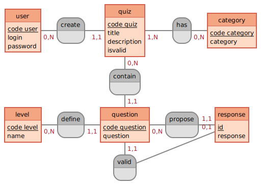

# Gestion de projet

## Notre projet : OQuiz

Besoin : plateforme de quiz

https://drive.google.com/file/d/1XhoR1ykfXFfXrqE3MFo04k9mhVERqPlE/view?usp=sharing

Méthodologie de projet : Scrum

Scrum :

- on découpe notre projet user stories
- on crèe des sprints

### User stories

Un visiteur est une personne non connectée.
Un utilisateur est une personne connectée.
Un admin est un utilisateur qui a la possibilité de créer/éditer/supprimer des quiz.

|En tant que|J'ai besoin de|afin de|sprint
|---|---|---|---|
|init|---|---|0|
|visiteur|une page d'accueil||1
|visiteur|afficher le titre du site sur la page d'accueil avec un lien dessus vers celle-ci||1
|visiteur|un lien vers la page de connexion depuis la page d'accueil|me connecter|1
|visiteur|un champ de recherche sur la page d'accueil|rechercher un quiz|1
|visiteur|un text explicatif des quiz sur la page d'accueil||1
|visiteur|un menu de navigation via les catégories||1
|visiteur|placer un footer||1

|visiteur|un formulaire de connexion|me connecter||N level, 11 question1
|visiteur|une page qui liste tous les quizz dispo|choisir mon quizz|1
|visiteur|choisir la complexité des questions||1|
|visiteur|choisir la catégorie|afin de choisir une catégorie pour les questions|1|
|utilisateur|affiche les questions de mon quizz choisi|répondre aux questions|
|utilisateur|une page qui affiche les résultats aux quiz|||
|utilisateur|pouvoir se déconnecter|||
|admin|créer des utilisateurs|||
|admin | de créer ou d'editer des quizz | renouveler les questions |

### Listes des tables en BDD

- QUIZ
- CATEGORY
- QUESTION
- RESPONSE
- GOOD_ANSWER
- LEVEL
- USER (student / admin)

## Cycle de vie de notre projet

1. Quelles sont les pages à réaliser ?

Par rapport à la vidéo, quelles conclusions je tire vis à vis des pages à réaliser.

Pages pour les utilisateurs non connectés (visiteur)

- homepage / accueil
- page d'inscription
- page de connexion
- liste des quiz
- liste des quiz par thématique
- affichage en lecture seule du quiz
- page de résultats de recherche
- 404

Pages pour les utilisateurs connectés (utilisateur) :

- page pour répondre à un quiz
- résultat d'un quiz
- page de profil

Pages pour les admin (admin) :

- page de gestion des utilisateurs
- ajout d'un utilisateur
- édition d'un utilisateur
- page gestion des quiz
- création de quiz
- édition d'un quiz
- page de gestion des thématiques

### WIREFRAMES

Les Wireframes sont des croquis/gabarit de la page à réaliser. Elles permettent de se faire une idées des composants et où les placer.

### MCD

Le MCD va permettre d'avoir une vue globale de notre base de données.
On écrit les tables et leurs liaisons afin de se mettre en accord avec le fonctionnement attendu de notre application web (site web).

## Etapes globales d'un projet

On peut détailler un projet en différentes étapes :

1. J'initialise mon projet
   1. création des users stories
   2. mise en place de la BDD

2. Quel est le sprint 1 ?

3. Quel est le sprint 2 ?

4. Quel est le sprint 3 ?

5. ....

6. Mise en production de notre projet
